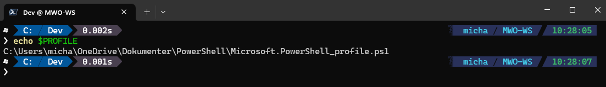
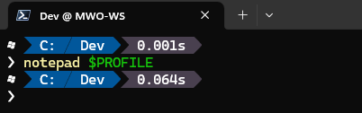
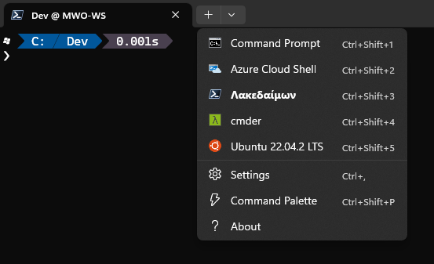

# Note to self

Setting up a nice developer prompt for me myself and I. The developer prompt is based on:

* Git friendlyness
* Windows Terminal
* Powershell 7
* Nice auto-completion with history et al
* Nothing invented, basically based on what [Scott Hanselmann suggests](https://www.hanselman.com/blog/my-ultimate-powershell-prompt-with-oh-my-posh-and-the-windows-terminal)

## Install Git for Windows

Do this first. Can be found [here](https://gitforwindows.org/)

## Install Windows Terminal

Either find it in Microsoft Store or from the [release page on github](https://github.com/microsoft/terminal). Mind, that you can choose between:

* Release (stable) or preview. 
* You have to choose the right one for your operating system - Windows 10 or Windows 11.

## Install Powershell 7

Follow instructions [here](https://learn.microsoft.com/en-us/powershell/scripting/install/installing-powershell-on-windows?view=powershell-7.3). This simple command line should do the job:

```
winget install --id Microsoft.Powershell --source winget
```

If Powershell 7 is not the default shell for Windows Terminal, you can set it via:


Select "Settings":


The highligthed stuff is the Guid, that identifies Powershell 7 (to be found further down in the file).

## Install Oh-my-posh

Next, we should install oh-my-posh - for further details, see [here](https://ohmyposh.dev/docs/installation/windows). The short path is just to execute:

```
winget install JanDeDobbeleer.OhMyPosh -s winget
```

## Install Posh-git

In a Powershell command prompt execute:

```
Install-Module Posh-Git
```

## Install Terminal-Icons

In a Powershell command prompt execute:

```
Install-Module Terminal-Icons
```

## Install PSReadline

In a Powershell command prompt execute:

```
Install-Module PSReadline -Force
```

## Fetch and utilize nerdy fonts

Go to [NerdFont](https://www.nerdfonts.com/) and fetch Cove Nerd Fonts - can also be fetched directly [here](https://github.com/ryanoasis/nerd-fonts/releases/download/v2.2.2/CascadiaCode.zip). It's a zip-file, unpack it all, mark all files and install the lot.

Do the following to utilize the right font in Windows Terminal:


## Setting up the Powershell-profile and posh.json

Make a local folder, called C:\Terminal. In this folder, create a blank file named posh.json:

```
cd c:\
mkdir Terminal
cd Terminal
notepad posh.json
```

In this file, copy the following content:

```
{
  "$schema": "https://raw.githubusercontent.com/JanDeDobbeleer/oh-my-posh/main/themes/schema.json",
  "blocks": [
    {
      "alignment": "left",
      "segments": [
        {
          "background": "#ff479c",
          "foreground": "#ffffff",
          "leading_diamond": "\ue0b6",
          "powerline_symbol": "\ue0b0",
          "properties": {
            "style": "folder"
          },
          "style": "diamond",
          "trailing_diamond": "\ue0b0",
          "type": "path"
        },
        {
          "background": "#fffb38",
          "foreground": "#193549",
          "powerline_symbol": "\ue0b0",
          "properties": {
            "fetch_stash_count": true,
            "fetch_status": true,
            "fetch_upstream_icon": true
          },
          "style": "powerline",
          "type": "git"
        },
        {
          "background": "#6CA35E",
          "foreground": "#ffffff",
          "powerline_symbol": "\ue0b0",
          "properties": {
            "fetch_version": true
          },
          "style": "powerline",
          "type": "dotnet"
        },
        {
          "background": "#ffff66",
          "foreground": "#ffffff",
          "powerline_symbol": "\ue0b0",
          "style": "powerline",
          "type": "root"
        },
        {
          "background": "#2e9599",
          "background_templates": [
            "{{ if gt .Code 0 }}#f1184c{{ end }}"
          ],
          "foreground": "#ffffff",
          "powerline_symbol": "\ue0b0",
          "properties": {
            "always_enabled": true
          },
          "style": "powerline",
          "trailing_diamond": "\ue0b4",
          "type": "exit"
        }
      ],
      "type": "prompt"
    }
  ],
  "final_space": true,
  "version": 2
}
```

Save and close notepad.

Create your Powershell-7 profile. In a Powershell-7 command line, you can see the name of the profile-file via:

```
echo $PROFILE
```



Ensure using the Windows Explorer, that the full folder-path exists. Whether the file exists or not, edit it:



Enter the following content to the file:

```
# Find out if the current user identity is elevated (has admin rights)
$identity = [Security.Principal.WindowsIdentity]::GetCurrent()
$principal = New-Object Security.Principal.WindowsPrincipal $identity
$isAdmin = $principal.IsInRole([Security.Principal.WindowsBuiltInRole]::Administrator)

# If so and the current host is a command line, then change to red color 
# as warning to user that they are operating in an elevated context
# Useful shortcuts for traversing directories
function cd... { Set-Location ..\.. }
function cd.... { Set-Location ..\..\.. }

# Compute file hashes - useful for checking successful downloads 
function md5 { Get-FileHash -Algorithm MD5 $args }
function sha1 { Get-FileHash -Algorithm SHA1 $args }
function sha256 { Get-FileHash -Algorithm SHA256 $args }

# Quick shortcut to start notepad
function n { notepad $args }

# Drive shortcuts
function HKLM: { Set-Location HKLM: }
function HKCU: { Set-Location HKCU: }
function Env: { Set-Location Env: }

# Creates drive shortcut for Work Folders, if current user account is using it
if (Test-Path "$env:USERPROFILE\Work Folders") {
    New-PSDrive -Name Work -PSProvider FileSystem -Root "$env:USERPROFILE\Work Folders" -Description "Work Folders"
    function Work: { Set-Location Work: }
}

# Set up command prompt and window title. Use UNIX-style convention for identifying 
# whether user is elevated (root) or not. Window title shows current version of PowerShell
# and appends [ADMIN] if appropriate for easy taskbar identification
function prompt { 
    if ($isAdmin) {
        "[" + (Get-Location) + "] # " 
    } else {
        "[" + (Get-Location) + "] $ "
    }
}

$Host.UI.RawUI.WindowTitle = "PowerShell {0}" -f $PSVersionTable.PSVersion.ToString()
if ($isAdmin) {
    $Host.UI.RawUI.WindowTitle += " [ADMIN]"
}

# Does the the rough equivalent of dir /s /b. For example, dirs *.png is dir /s /b *.png
function dirs {
    if ($args.Count -gt 0) {
        Get-ChildItem -Recurse -Include "$args" | Foreach-Object FullName
    } else {
        Get-ChildItem -Recurse | Foreach-Object FullName
    }
}

# Simple function to start a new elevated process. If arguments are supplied then 
# a single command is started with admin rights; if not then a new admin instance
# of PowerShell is started.
function admin {
    if ($args.Count -gt 0) {   
        $argList = "& '" + $args + "'"
        Start-Process "$psHome\powershell.exe" -Verb runAs -ArgumentList $argList
    } else {
        Start-Process "$psHome\powershell.exe" -Verb runAs
    }
}

# Set UNIX-like aliases for the admin command, so sudo <command> will run the command
# with elevated rights. 
Set-Alias -Name su -Value admin
Set-Alias -Name sudo -Value admin


# Make it easy to edit this profile once it's installed
function Edit-Profile {
    if ($host.Name -match "ise") {
        $psISE.CurrentPowerShellTab.Files.Add($profile.CurrentUserAllHosts)
    } else {
        notepad $profile.CurrentUserAllHosts
    }
}

# We don't need these any more; they were just temporary variables to get to $isAdmin. 
# Delete them to prevent cluttering up the user profile. 
Remove-Variable identity
Remove-Variable principal

Function Test-CommandExists {
    Param ($command)
    $oldPreference = $ErrorActionPreference
    $ErrorActionPreference = 'SilentlyContinue'
    try { if (Get-Command $command) { RETURN $true } }
    Catch { Write-Host "$command does not exist"; RETURN $false }
    Finally { $ErrorActionPreference = $oldPreference }
} 
#
# Aliases
#
# If your favorite editor is not here, add an elseif and ensure that the directory it is installed in exists in your $env:Path
#
if (Test-CommandExists nvim) {
    $EDITOR='nvim'
} elseif (Test-CommandExists pvim) {
    $EDITOR='pvim'
} elseif (Test-CommandExists vim) {
    $EDITOR='vim'
} elseif (Test-CommandExists vi) {
    $EDITOR='vi'
} elseif (Test-CommandExists code) {
    $EDITOR='code'
} elseif (Test-CommandExists notepad) {
    $EDITOR='notepad'
} elseif (Test-CommandExists notepad++) {
    $EDITOR='notepad++'
} elseif (Test-CommandExists sublime_text) {
    $EDITOR='sublime_text'
}
Set-Alias -Name vim -Value $EDITOR


function ll { Get-ChildItem -Path $pwd -File }
function g { Set-Location $HOME\Documents\Github }
function gcom {
    git add .
    git commit -m "$args"
}
function lazyg {
    git add .
    git commit -m "$args"
    git push
}
function Get-PubIP {
    (Invoke-WebRequest http://ifconfig.me/ip ).Content
}
function uptime {
    #Windows Powershell only
	If ($PSVersionTable.PSVersion.Major -eq 5 ) {
		Get-WmiObject win32_operatingsystem |
        Select-Object @{EXPRESSION={ $_.ConverttoDateTime($_.lastbootuptime)}} | Format-Table -HideTableHeaders
	} Else {
        net statistics workstation | Select-String "since" | foreach-object {$_.ToString().Replace('Statistics since ', '')}
    }
}

function reload-profile {
    & $profile
}
function find-file($name) {
    Get-ChildItem -recurse -filter "*${name}*" -ErrorAction SilentlyContinue | ForEach-Object {
        $place_path = $_.directory
        Write-Output "${place_path}\${_}"
    }
}
function unzip ($file) {
    Write-Output("Extracting", $file, "to", $pwd)
    $fullFile = Get-ChildItem -Path $pwd -Filter .\cove.zip | ForEach-Object { $_.FullName }
    Expand-Archive -Path $fullFile -DestinationPath $pwd
}
function ix ($file) {
    curl.exe -F "f:1=@$file" ix.io
}
function grep($regex, $dir) {
    if ( $dir ) {
        Get-ChildItem $dir | select-string $regex
        return
    }
    $input | select-string $regex
}
function touch($file) {
    "" | Out-File $file -Encoding ASCII
}
function df {
    get-volume
}
function sed($file, $find, $replace) {
    (Get-Content $file).replace("$find", $replace) | Set-Content $file
}
function which($name) {
    Get-Command $name | Select-Object -ExpandProperty Definition
}
function export($name, $value) {
    set-item -force -path "env:$name" -value $value;
}
function pkill($name) {
    Get-Process $name -ErrorAction SilentlyContinue | Stop-Process
}
function pgrep($name) {
    Get-Process $name
}

Import-Module PSReadLine
Import-Module Terminal-Icons

Set-PSReadLineOption -PredictionSource History
Set-PSReadLineOption -PredictionViewStyle ListView
Set-PSReadLineOption -EditMode Windows

# Import the Chocolatey Profile that contains the necessary code to enable
# tab-completions to function for `choco`.
# Be aware that if you are missing these lines from your profile, tab completion
# for `choco` will not function.
# See https://ch0.co/tab-completion for details.
$ChocolateyProfile = "$env:ChocolateyInstall\helpers\chocolateyProfile.psm1"
if (Test-Path($ChocolateyProfile)) {
  Import-Module "$ChocolateyProfile"
}


Import-Module posh-git
oh-my-posh init pwsh --config 'C:\Dev\oh-my-posh\themes\blue-owl.omp.json' | Invoke-Expression
```

Save and close.

## Start folder

Since it is a developer prompt, set up the start folder by:


# Adding cmder





## Using oh-my-posh in cmder

Open the config for cmder:


Add the following in the end of this lua script:

```
load(io.popen('oh-my-posh init cmd --config C:/Dev/oh-my-posh/themes/blue-owl.omp.json'):read("*a"))()
```

This assumes that you've cloned the oh-my-posh code under C:\Dev. Alternatively you can reference the github repo directly


# WSL

Simply install in ie ubuntu, and in the end of the ```.zshrc``` file add:

```
eval "$(oh-my-posh init zsh --config /home/michael/dev/oh-my-posh/themes/blue-owl.omp.json)"
```

Again assuming a local clone of oh-my-posh


# Mac

Using iterm2 and zsh the WSL setup also works.